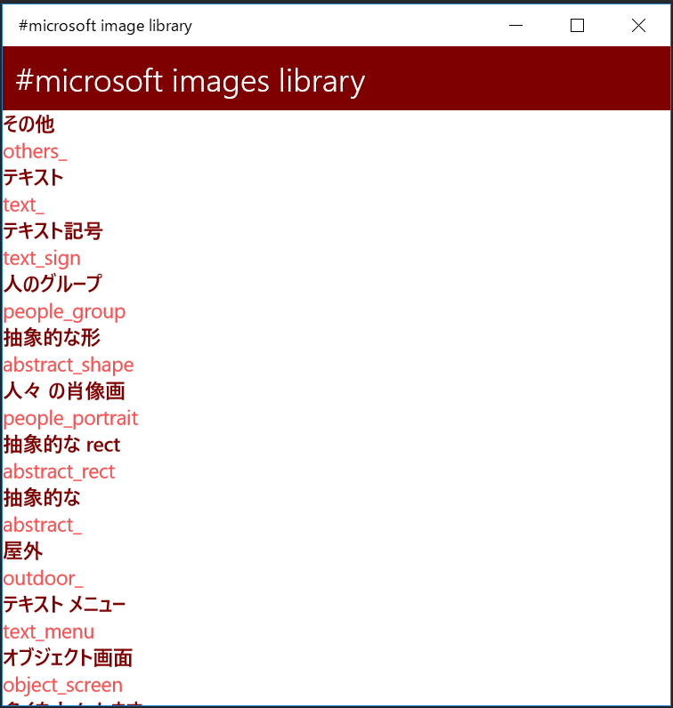

# CognitiveServicesSample
Microsoft Cognitive Servicesを使用したサンプルアプリケーションです。

## このサンプルについて

Microsoft Cognitive Services を用いて Twitter 上の #microsoft ハッシュタグの画像を収集して自動でカテゴリわけを行い、画像の概要を作成しています。カテゴリ名と画像の概要については、同じく Microsoft Cognitive Services の Translator API を使用して日本語に翻訳しています。

画像を分類した結果は Microsoft Azure の Cosmos DB に格納しています。画像の分析処理は Microsoft Azure の Functions を使用して行っています。

画像のカテゴリ分けをした結果を閲覧するクライアントアプリケーションは Xamarin.Forms で MVVM フレームワークの Prism を使用して作成しています。

## アプリケーションの画面

