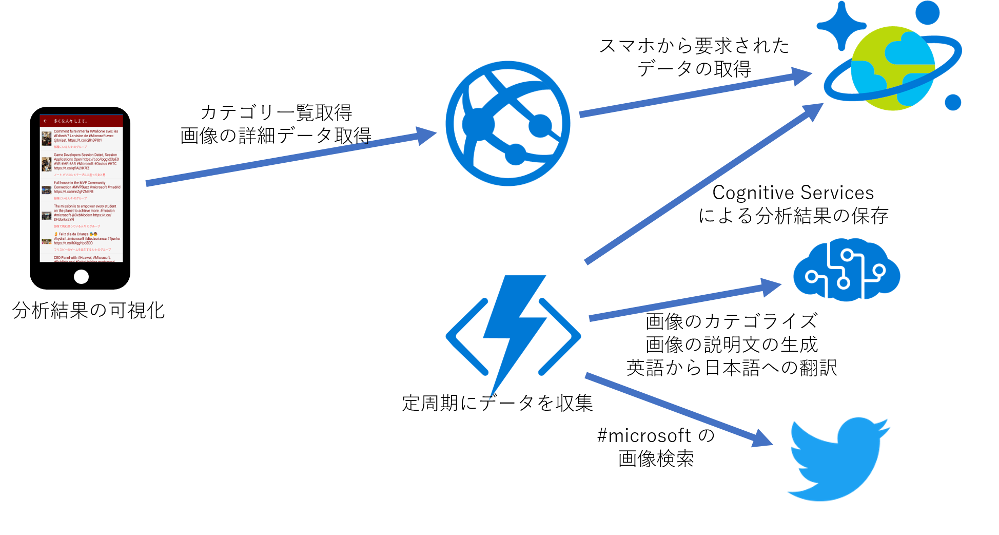
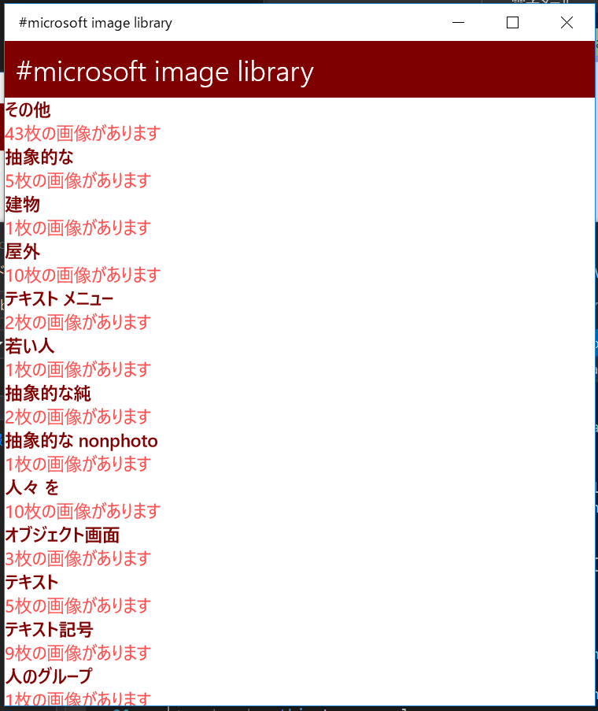
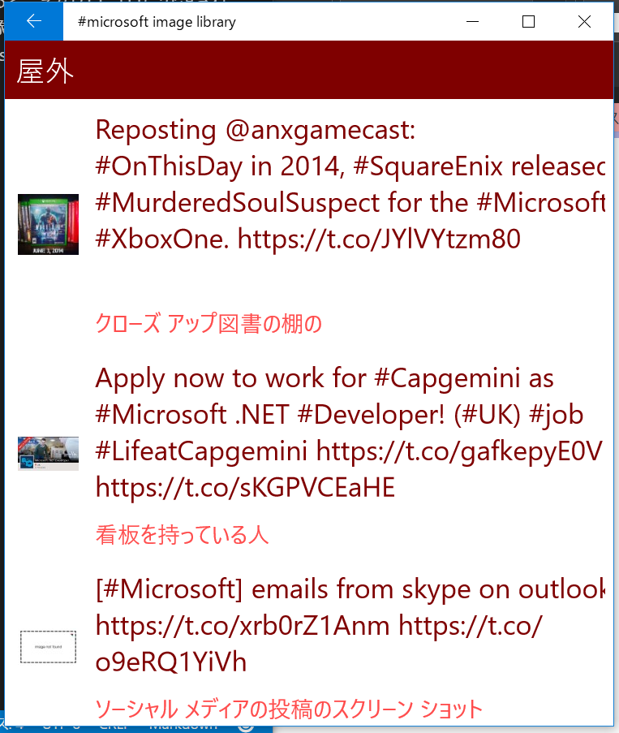
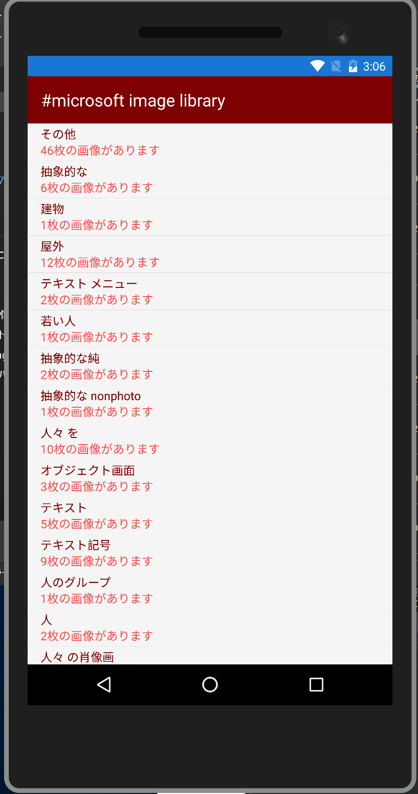
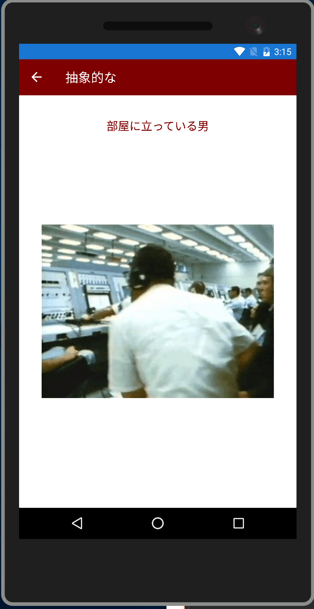

# CognitiveServicesSample
Microsoft Cognitive Servicesを使用したサンプルアプリケーションです。

## このサンプルについて

Microsoft Cognitive Services を用いて Twitter 上の #microsoft ハッシュタグの画像を収集して自動でカテゴリわけを行い、画像の概要を作成しています。カテゴリ名と画像の概要については、同じく Microsoft Cognitive Services の Translator API を使用して日本語に翻訳しています。

画像を分類した結果は Microsoft Azure の Cosmos DB に格納しています。画像の分析処理は Microsoft Azure の Functions を使用して行っています。

画像のカテゴリ分けをした結果を閲覧するクライアントアプリケーションは Xamarin.Forms で MVVM フレームワークの Prism を使用して作成しています。

## システムの概要

以下のような構成になっています。

## クライアントサイド

### 使用テクノロジ

以下のライブラリを使用しています。

- Xamarin.Forms 2.5(preview)
- Prism.Forms
- FFImageLoading

### 構造

Client ソリューションフォルダ内の CognitiveServicesSample.Client(クライアントサイドの共通ロジックが入っています。), CognitiveServicesSample.Droid(Android用のコードが入っています。), CognitiveServicesSample.iOS(iOS用のコードが入っています), CognitiveServicesSample.UWP(UWP用のコードが入っています。) がクライアントサイドの主なプロジェクトです。 Commons ソリューションフォルダ内の　CognitiveServicesSample.Commons プロジェクトにサーバーサイドとのデータのやり取りのためのフォーマットを定義したクラスが入っています。

### クラス構造

MVVM パターンを使用して作成しています。

#### Model

`Services` 名前空間にサーバーサイドとの通信を行うクラスが定義されています。`HttpClient`クラスを使用して Azure Web App 上に展開された WebAPI を呼び出しています。

#### ViewModel

`ViewModels` 名前空間に画面ごとの ViewModel が定義されています。

#### View

`Views` 名前空間に画面が定義されています。初期表示用の `MainPage` とカテゴリわけされた画像の一覧を表示するための `CategorizedImagePage` があります。

### カスタムコントロール

以下のカスタムコントロールを作成しています。

- IncrementalLoadingListView
    - 画面の下までデータをスクロールしたときに、続きのデータを追加で読み込む処理を追加した ListView になります。

## サーバーサイド

### 使用テクノロジ

以下のテクノロジを使用しています。

- Microsoft Azure
    - Functions
    - Cosmos DB
    - Web App
    - Cognitive Services
        - Vision API
        - Translator Text API
- ASP.NET WebAPI

### 構造

Functions に定義された AnalyzeTask が定周期で Twitter から #microsoft というハッシュタグ上の画像を検索しています。検索結果の中から新規に見つけたツイートの画像を Vision API を使ってカテゴリわけと、画像の概要を生成しています。Vision API の結果は、すべて英語なので Translator Text API でカテゴリ名と画像の概要を翻訳しています。

Cognitive Services による認識結果は Cosmos DB に以下の2つのコレクションを作成して格納しています。

- CategoriesCollection
    - 今まで収集した画像を分類した結果得られたカテゴリ名の一覧
- CategorizedImageCollection
    - 検索した画像を Vision API で認識した結果の一覧

サーバーサイドの Visual Studio のプロジェクトは以下のものになります。

- CognitiveServiceSample.Functions
    - Functions にデプロイするためのプロジェクトです
- CognitiveServiceSample.Jobs
    - Functions で使用する各種サービスクラスが定義されています。主に Twitter からの検索と Cognitive Services を呼び出す処理が定義されています。
- CognitiveServicesSample.Data
    - サーバーサイドで共通で使用するデータアクセスクラスが定義されています。Cosmos DB への CRUD 処理を定義しています。
- CognitiveServicesSample.Web
    - クライアントサイドと連携するための WebAPI を定義しています。ASP.NET WebAPI を使用しています。

### デプロイに必要な Azure のリソース

- Azure Cosmos DB account
- App Service Plan
    - Web App
    - Functions
- Cognitive Services
    - Vision API
    - Translator Text API

## アプリケーションの画面

### UWP

現在収集したイメージのカテゴリを一覧表示します。

一覧表示されたカテゴリをタップすると、そのカテゴリに分類された画像のリストが表示されます。画像と一緒に、その画像とともにされたツイートと、Cognitive Services で生成された画像の概要が表示されます。

画像をタップすると、その画像のプレビューが表示されます。プレビュー画面をタップするとプレビューが閉じられます。

### Android

現在収集したイメージのカテゴリを一覧表示します。

一覧表示されたカテゴリをタップすると、そのカテゴリに分類された画像のリストが表示されます。画像と一緒に、その画像とともにされたツイートと、Cognitive Services で生成された画像の概要が表示されます。

画像をタップすると、その画像のプレビューが表示されます。プレビュー画面をタップするとプレビューが閉じられます。

# 関連記事

このサンプルについてのBlog記事を書きました。

- [Xamarin.Forms と Azure の組み合わせサンプル書いてみたよ](http://blog.okazuki.jp/entry/2017/06/05/180748)